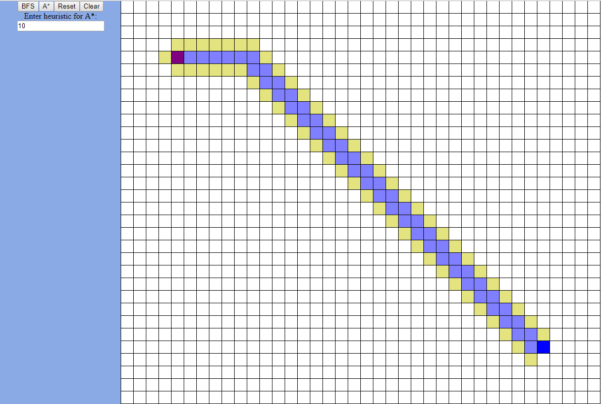
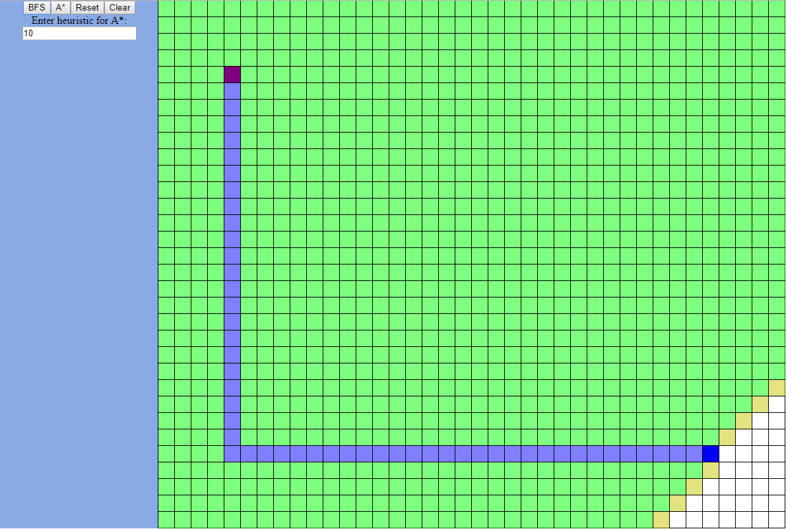
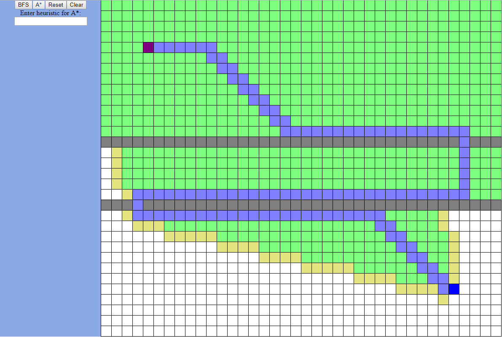
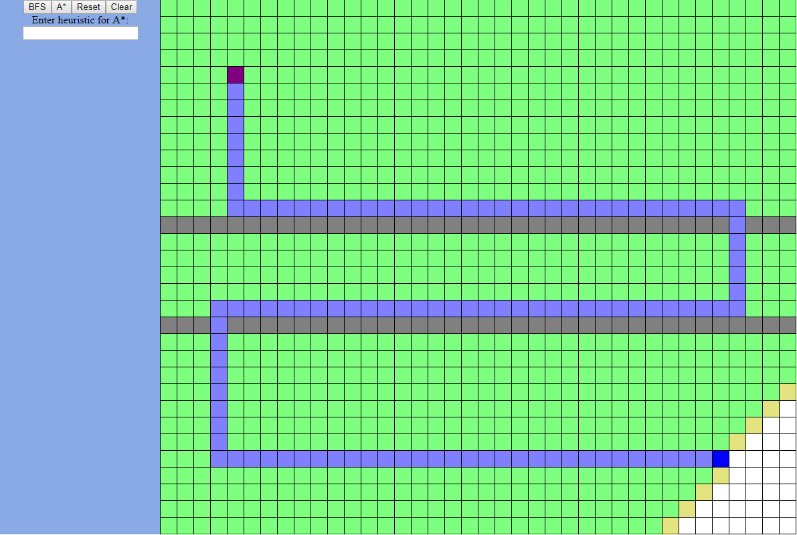

# Search Algorithms

This project was bootstrapped with [Create React App](https://github.com/facebook/create-react-app).

This project uses React and JavaScript to implement and visualize the Breath First Search and A* Search algorithms.

## How to Run

Inside project directory: 

`npm start`

When the application starts, you will see the view is divided into two part, the left part is a control panel and the right part is a grid used to visualize the search algorithms.

## How to Interpret the Grid:

Red is the start, and Blue is the goal. White tiles are floors that the agent can travel on whereas gray tiles are walls blocking agent's movement. Click on any floor tile to change it to a wall. 

Once the serach is finished, tiles will be shaded in different color. Green shaded tiles are tiles visited by the agent, yellow shaded tiles are tiles inside the frontier (not yet visited), and blue shaded tiles is the a path found.

## How to use the control panel:

Click "BFS" or "A*" to start the corresponding search. Press "Reset" button to reset the clear the search result, and "Clear" button to clear out the search result and and walls that are placed. You can specify the coefficient of the heuristic function by typing it in the text box.

## Screenshots:

A* with heuristic coefficient = 10 (Euclidiean distance)

Same map as above using BFS

A* with heuristic coefficient = 1.2 (Consistent)

Same map as above using BFS

